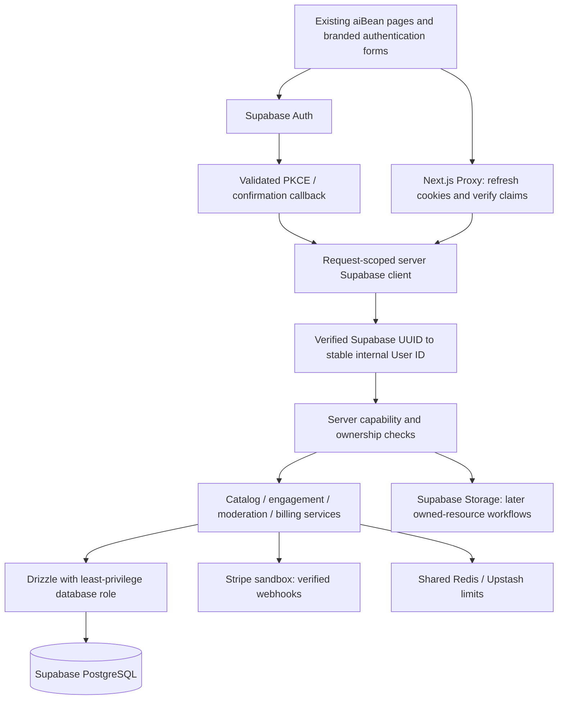

# Supabase authentication architecture

Status: approved target architecture; implementation pending database/identity verification. Assessment: 8 October 2026. This document supersedes older Clerk/temporary-login plans, not the immutable October 7 audit in `docs/audit/`.

## Current evidence

The baseline is commit `31234704677df5e7f0252b30d996232a6602e726`, verified against GitHub main. The application currently selects custom password authentication or Clerk in `src/lib/auth.ts`. Local configuration selects password mode. Neither Supabase application package is installed at this assessment; application Supabase URL/key and DATABASE_URL are absent. The MCP login authenticates the development agent, not website visitors, and does not configure the application's database connection.

Codex configuration contains `supabase` with project ref `yfknxidgphhepdtwazhn`. No `supabase-aibean-dev` registration or callable Supabase tools are exposed in this chat. Project identity, live tables, historical Users, applied migrations, grants, RLS, Auth settings and provider configuration are unverified. Docker's Linux engine is unavailable. No cloud query, migration, seed, account change or provider activation occurred.

## Target flow

Supabase Auth is the only target identity provider. Drizzle remains the server-side application ORM. Browser clients use only the Supabase publishable key; no privileged key or database URL reaches the browser. Use separate `src/lib/supabase/client.ts`, `server.ts` and `proxy.ts` utilities. Preserve `src/proxy.ts` as the framework entry point. Proxy refreshes cookies; individual server operations still authorize access.

Use `getClaims()` for verified identity, `getUser()` for fresh account state where needed, and never use cookie-derived `getSession().user` for authorization. Forward refreshed cookies and cache-control headers on redirects. Sensitive responses are private/no-store; do not cache sessions or shared per-user results. Follow the current [Supabase Next.js SSR guide](https://supabase.com/docs/guides/auth/server-side/creating-a-client?queryGroups=framework&framework=nextjs).

Use Supabase-managed password storage. The existing password policy remains at least eight characters, uppercase, a digit and a special non-space character; configure provider enforcement consistently before release. Never migrate the shared preview password into a privileged public account. Retire custom signing/password modules and Clerk only after the new flow and data continuity pass validation, in one coordinated active-auth cutover. No runtime fallback to legacy authentication after cutover.

## Route specification

| Route | Planned behavior | Security boundary |
|---|---|---|
| `/login` | Email/password; configured social methods; passwordless/phone disclosure | Generic credential errors, shared rate limits, configuration-aware visibility |
| `/register` | Verified registration through Supabase | Create ordinary capability only; no client-selected role |
| `/auth/callback` | Exchange OAuth/PKCE code, establish verified session | Fixed configured app origin; safe same-origin return path; cancellation/error states; no code/token logging |
| `/auth/confirm` | Validate allowlisted email token type/hash, create session | Expired/reused tokens fail safely; recovery goes only to reset flow; redact URL tokens |
| `/forgot-password` | Request provider-managed recovery | Uniform response, resend cooldown, abuse controls |
| `/reset-password` | Change password within a verified recovery flow | Require recovery/reauth proof, not an arbitrary logged-in session or client flag |
| `/account/security` | Password/email/phone changes, MFA, session controls, eligible passkeys | Fresh identity, recent proof and required AAL; confirmation of new email/phone |
| `/account/connected-accounts` | List/link/unlink eligible provider identities | Fresh verified session; Supabase ownership proof; retain a usable recovery/sign-in method |
| Existing logout endpoint | POST logout, clear provider cookies and legacy cookie at cutover | Origin/CSRF checks; documented local/global session scope |

All routes are planned unless explicitly marked implemented in `FOUNDATION_PROGRESS.md`. Preserve the current page width, form styling, typography, header/footer and discovery layout. Loading, invalid-code, expired-session, rate-limit, cancellation, retry and success states are required. Do not show a button merely because a provider appears in the registry.

## Configuration boundary

Operators configure the project URL/publishable key, server-only database URL, canonical application URL, redirect allowlist, mail delivery/templates, password/verification rules, optional SMS delivery and provider credentials. Registry metadata may be public; provider secrets may not. Provider callback URLs come from the actual project/provider configuration, never invented deployment domains. Registry statuses and readiness requirements are in `SUPABASE_AUTH_PROVIDERS.md`.

For shared/non-disposable targets, present exact target, SQL, lock/data impact, recovery approach and validation steps for owner approval before any database mutation. Agent OAuth authorization is not that approval.
